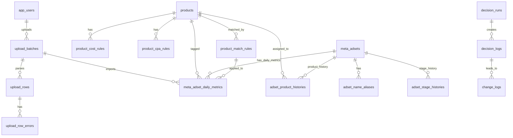

# 메타광고관리기 DB 스키마 설계

대상 요구사항: `메타광고관리기_요구사항.html`  
기준 스택: Next.js, NestJS, PostgreSQL

## 1. 설계 원칙

1. 원본 CSV 값과 계산/판정 값을 분리한다.
2. 제품 원가, 환율, CPA 기준, 광고 단계는 날짜별 이력을 가진다.
3. CSV 중복 업로드는 파일 해시와 `일자 + 광고세트` 현재 버전 unique 정책을 같이 사용한다.
4. 광고세트 ID가 없는 MVP 상황을 고려해 `adset_name_key`를 임시 식별자로 쓰고, 추후 메타 광고세트 ID가 들어오면 우선한다.
5. 자동 매칭/자동 판정 결과는 반드시 당시의 스냅샷을 남긴다.
6. 대시보드 계산은 기본적으로 원천 테이블에서 집계하고, 속도가 느려지면 materialized view를 추가한다.

## 2. 핵심 ERD



## 3. 권장 PostgreSQL DDL

### 3.1 공통 타입

```sql
CREATE EXTENSION IF NOT EXISTS pgcrypto;

CREATE TYPE upload_status AS ENUM (
  'PENDING',
  'VALIDATING',
  'VALIDATED',
  'IMPORTED',
  'PARTIAL',
  'FAILED',
  'CANCELLED'
);

CREATE TYPE upload_level AS ENUM ('ADSET', 'AD', 'CAMPAIGN');
CREATE TYPE conflict_policy AS ENUM ('SKIP', 'OVERWRITE', 'NEW_VERSION');
CREATE TYPE row_validation_status AS ENUM ('VALID', 'WARNING', 'ERROR', 'UNMATCHED');
CREATE TYPE match_type AS ENUM ('CONTAINS', 'EXACT', 'REGEX', 'MANUAL');
CREATE TYPE match_source AS ENUM ('RULE', 'MANUAL', 'INFERRED', 'UNMATCHED');
CREATE TYPE ad_stage AS ENUM ('SC', 'CBO', 'ASC', 'UNKNOWN');

CREATE TYPE decision_type AS ENUM (
  'SCALE',
  'KEEP',
  'WATCH',
  'STOP_CANDIDATE',
  'SC_TO_CBO',
  'CBO_TO_ASC',
  'SC_TO_ASC',
  'ASC_TO_SC',
  'PROFIT',
  'LOSS'
);

CREATE TYPE report_type AS ENUM (
  'DAILY_HTML',
  'PERIOD_XLSX',
  'CHANGE_LOG_XLSX',
  'CPA_RULE_XLSX'
);
```

### 3.2 사용자

MVP에서는 단일 사용자여도 `created_by`, `uploaded_by` 추적을 위해 최소 사용자 테이블을 둔다.

```sql
CREATE TABLE app_users (
  id uuid PRIMARY KEY DEFAULT gen_random_uuid(),
  email text UNIQUE,
  name text NOT NULL,
  role text NOT NULL DEFAULT 'ADMIN',
  is_active boolean NOT NULL DEFAULT true,
  created_at timestamptz NOT NULL DEFAULT now(),
  updated_at timestamptz NOT NULL DEFAULT now()
);
```

### 3.3 제품 마스터와 손익 기준

`product_cost_rules`와 `product_cpa_rules`는 과거 데이터를 당시 기준으로 다시 볼 수 있게 유효기간을 가진다.

```sql
CREATE TABLE products (
  id uuid PRIMARY KEY DEFAULT gen_random_uuid(),
  code text NOT NULL UNIQUE,
  name text NOT NULL,
  display_name text NOT NULL,
  sku text,
  sort_order integer NOT NULL DEFAULT 100,
  is_active boolean NOT NULL DEFAULT true,
  created_at timestamptz NOT NULL DEFAULT now(),
  updated_at timestamptz NOT NULL DEFAULT now()
);

CREATE TABLE product_cost_rules (
  id uuid PRIMARY KEY DEFAULT gen_random_uuid(),
  product_id uuid NOT NULL REFERENCES products(id),
  sale_price_krw numeric(14,2) NOT NULL,
  vat_krw numeric(14,2) NOT NULL DEFAULT 0,
  product_cost_krw numeric(14,2) NOT NULL DEFAULT 0,
  shipping_krw numeric(14,2) NOT NULL DEFAULT 0,
  extra_cost_krw numeric(14,2) NOT NULL DEFAULT 0,
  fx_rate_krw_per_usd numeric(12,4) NOT NULL,
  ad_cost_multiplier numeric(6,3) NOT NULL DEFAULT 1.100,
  effective_from date NOT NULL,
  effective_to date,
  note text,
  created_at timestamptz NOT NULL DEFAULT now(),
  updated_at timestamptz NOT NULL DEFAULT now(),
  CHECK (sale_price_krw >= 0),
  CHECK (fx_rate_krw_per_usd > 0),
  CHECK (ad_cost_multiplier > 0),
  CHECK (effective_to IS NULL OR effective_to >= effective_from)
);

CREATE TABLE product_cpa_rules (
  id uuid PRIMARY KEY DEFAULT gen_random_uuid(),
  product_id uuid NOT NULL REFERENCES products(id),
  target_ratio numeric(6,4) NOT NULL DEFAULT 0.8000,
  watch_ratio numeric(6,4) NOT NULL DEFAULT 1.1000,
  stop_ratio numeric(6,4) NOT NULL DEFAULT 1.2500,
  effective_from date NOT NULL,
  effective_to date,
  note text,
  created_at timestamptz NOT NULL DEFAULT now(),
  updated_at timestamptz NOT NULL DEFAULT now(),
  CHECK (target_ratio > 0),
  CHECK (watch_ratio >= target_ratio),
  CHECK (stop_ratio >= watch_ratio),
  CHECK (effective_to IS NULL OR effective_to >= effective_from)
);

CREATE INDEX idx_product_cost_rules_product_period
  ON product_cost_rules(product_id, effective_from, effective_to);

CREATE INDEX idx_product_cpa_rules_product_period
  ON product_cpa_rules(product_id, effective_from, effective_to);
```

계산식:

- 광고 전 공헌이익: `sale_price_krw - vat_krw - product_cost_krw - shipping_krw - extra_cost_krw`
- 손익분기 CPA: `광고 전 공헌이익 / ad_cost_multiplier`
- 목표 CPA: `손익분기 CPA * target_ratio`
- 관찰 상한 CPA: `손익분기 CPA * watch_ratio`
- 중단 후보 CPA: `손익분기 CPA * stop_ratio`

### 3.4 광고세트 마스터와 매칭 이력

메타 CSV에 광고세트 ID가 없으므로 MVP에서는 `adset_name_key`를 애플리케이션에서 생성한다. 예: trim, 공백 정규화, 소문자 변환.

```sql
CREATE TABLE meta_adsets (
  id uuid PRIMARY KEY DEFAULT gen_random_uuid(),
  platform text NOT NULL DEFAULT 'META',
  external_adset_id text,
  adset_name text NOT NULL,
  adset_name_key text NOT NULL,
  first_seen_on date,
  last_seen_on date,
  current_product_id uuid REFERENCES products(id),
  current_stage ad_stage NOT NULL DEFAULT 'UNKNOWN',
  is_active boolean NOT NULL DEFAULT true,
  created_at timestamptz NOT NULL DEFAULT now(),
  updated_at timestamptz NOT NULL DEFAULT now()
);

CREATE UNIQUE INDEX uq_meta_adsets_platform_external
  ON meta_adsets(platform, external_adset_id)
  WHERE external_adset_id IS NOT NULL;

CREATE UNIQUE INDEX uq_meta_adsets_platform_name_key_without_external
  ON meta_adsets(platform, adset_name_key)
  WHERE external_adset_id IS NULL;

CREATE TABLE adset_name_aliases (
  id uuid PRIMARY KEY DEFAULT gen_random_uuid(),
  meta_adset_id uuid NOT NULL REFERENCES meta_adsets(id),
  alias_name text NOT NULL,
  alias_key text NOT NULL,
  source match_source NOT NULL DEFAULT 'INFERRED',
  first_seen_on date,
  last_seen_on date,
  created_at timestamptz NOT NULL DEFAULT now(),
  UNIQUE (alias_key)
);
```

제품 자동 매칭 규칙과 수동 이력은 분리한다. 포함 규칙은 `product_match_rules`, 특정 광고세트의 확정 매핑은 `adset_product_histories`가 담당한다.

```sql
CREATE TABLE product_match_rules (
  id uuid PRIMARY KEY DEFAULT gen_random_uuid(),
  match_type match_type NOT NULL,
  pattern text NOT NULL,
  pattern_key text,
  product_id uuid NOT NULL REFERENCES products(id),
  priority integer NOT NULL DEFAULT 100,
  is_active boolean NOT NULL DEFAULT true,
  valid_from date NOT NULL DEFAULT CURRENT_DATE,
  valid_to date,
  note text,
  created_by uuid REFERENCES app_users(id),
  created_at timestamptz NOT NULL DEFAULT now(),
  updated_at timestamptz NOT NULL DEFAULT now(),
  CHECK (valid_to IS NULL OR valid_to >= valid_from)
);

CREATE INDEX idx_product_match_rules_active_priority
  ON product_match_rules(is_active, priority);

CREATE TABLE adset_product_histories (
  id uuid PRIMARY KEY DEFAULT gen_random_uuid(),
  meta_adset_id uuid NOT NULL REFERENCES meta_adsets(id),
  product_id uuid NOT NULL REFERENCES products(id),
  effective_from date NOT NULL,
  effective_to date,
  source match_source NOT NULL DEFAULT 'MANUAL',
  match_rule_id uuid REFERENCES product_match_rules(id),
  note text,
  created_by uuid REFERENCES app_users(id),
  created_at timestamptz NOT NULL DEFAULT now(),
  CHECK (effective_to IS NULL OR effective_to >= effective_from)
);

CREATE INDEX idx_adset_product_histories_adset_period
  ON adset_product_histories(meta_adset_id, effective_from, effective_to);

CREATE TABLE adset_stage_histories (
  id uuid PRIMARY KEY DEFAULT gen_random_uuid(),
  meta_adset_id uuid NOT NULL REFERENCES meta_adsets(id),
  stage ad_stage NOT NULL,
  effective_from date NOT NULL,
  effective_to date,
  source match_source NOT NULL DEFAULT 'MANUAL',
  note text,
  created_by uuid REFERENCES app_users(id),
  created_at timestamptz NOT NULL DEFAULT now(),
  CHECK (effective_to IS NULL OR effective_to >= effective_from)
);

CREATE INDEX idx_adset_stage_histories_adset_period
  ON adset_stage_histories(meta_adset_id, effective_from, effective_to);
```

### 3.5 CSV 업로드 이력, 행별 원본, 검증 오류

업로드 화면의 미리보기, 오류 표시, 재처리, 중복 방지를 위한 테이블이다.

```sql
CREATE TABLE upload_batches (
  id uuid PRIMARY KEY DEFAULT gen_random_uuid(),
  original_filename text NOT NULL,
  stored_file_path text,
  file_hash_sha256 char(64) NOT NULL,
  report_start date,
  report_end date,
  level upload_level NOT NULL DEFAULT 'ADSET',
  column_schema jsonb NOT NULL,
  row_count integer NOT NULL DEFAULT 0,
  valid_row_count integer NOT NULL DEFAULT 0,
  warning_count integer NOT NULL DEFAULT 0,
  error_count integer NOT NULL DEFAULT 0,
  conflict_policy conflict_policy NOT NULL DEFAULT 'SKIP',
  status upload_status NOT NULL DEFAULT 'PENDING',
  timezone text NOT NULL DEFAULT 'Asia/Seoul',
  uploaded_by uuid REFERENCES app_users(id),
  uploaded_at timestamptz NOT NULL DEFAULT now(),
  validated_at timestamptz,
  imported_at timestamptz,
  note text,
  UNIQUE (file_hash_sha256)
);

CREATE INDEX idx_upload_batches_period
  ON upload_batches(report_start, report_end);

CREATE TABLE upload_rows (
  id uuid PRIMARY KEY DEFAULT gen_random_uuid(),
  upload_batch_id uuid NOT NULL REFERENCES upload_batches(id) ON DELETE CASCADE,
  row_number integer NOT NULL,
  source_row_hash char(64) NOT NULL,
  raw_row jsonb NOT NULL,
  parsed_row jsonb,
  date_start date,
  date_end date,
  adset_name text,
  adset_name_key text,
  meta_adset_id uuid REFERENCES meta_adsets(id),
  product_id uuid REFERENCES products(id),
  stage ad_stage NOT NULL DEFAULT 'UNKNOWN',
  product_match_source match_source NOT NULL DEFAULT 'UNMATCHED',
  product_match_rule_id uuid REFERENCES product_match_rules(id),
  validation_status row_validation_status NOT NULL DEFAULT 'VALID',
  validation_errors jsonb NOT NULL DEFAULT '[]'::jsonb,
  created_at timestamptz NOT NULL DEFAULT now(),
  UNIQUE (upload_batch_id, row_number)
);

CREATE INDEX idx_upload_rows_batch_status
  ON upload_rows(upload_batch_id, validation_status);

CREATE INDEX idx_upload_rows_unmatched
  ON upload_rows(product_match_source, validation_status)
  WHERE product_match_source = 'UNMATCHED';

CREATE TABLE upload_row_errors (
  id uuid PRIMARY KEY DEFAULT gen_random_uuid(),
  upload_batch_id uuid NOT NULL REFERENCES upload_batches(id) ON DELETE CASCADE,
  upload_row_id uuid REFERENCES upload_rows(id) ON DELETE CASCADE,
  row_number integer,
  column_name text,
  severity text NOT NULL DEFAULT 'ERROR',
  error_code text NOT NULL,
  message text NOT NULL,
  raw_value text,
  created_at timestamptz NOT NULL DEFAULT now()
);

CREATE INDEX idx_upload_row_errors_batch
  ON upload_row_errors(upload_batch_id, severity);
```

### 3.6 광고세트 일별 원천 성과

이 테이블이 대시보드와 리포트의 중심 fact table이다. CSV 컬럼은 가능한 원형에 가깝게 저장하고, 계산 지표는 view/service에서 만든다.

```sql
CREATE TABLE meta_adset_daily_metrics (
  id uuid PRIMARY KEY DEFAULT gen_random_uuid(),
  upload_batch_id uuid NOT NULL REFERENCES upload_batches(id),
  upload_row_id uuid UNIQUE REFERENCES upload_rows(id),
  meta_adset_id uuid NOT NULL REFERENCES meta_adsets(id),

  metric_date date NOT NULL,
  date_start date NOT NULL,
  date_end date NOT NULL,
  adset_name text NOT NULL,
  adset_name_key text NOT NULL,

  delivery_status text,
  attribution_setting text,
  result_count integer NOT NULL DEFAULT 0,
  result_indicator text,
  reach integer NOT NULL DEFAULT 0,
  frequency numeric(12,6),
  cost_per_result_usd numeric(14,4),
  adset_budget_label text,
  adset_budget_type text,
  spend_usd numeric(14,4) NOT NULL DEFAULT 0,
  end_status text,
  start_date date,
  impressions bigint NOT NULL DEFAULT 0,
  cpm_usd numeric(14,4),
  link_clicks integer NOT NULL DEFAULT 0,
  shop_clicks integer NOT NULL DEFAULT 0,
  cpc_link_usd numeric(14,4),
  ctr_link_pct numeric(10,6),
  clicks_all integer NOT NULL DEFAULT 0,
  ctr_all_pct numeric(10,6),
  cpc_all_usd numeric(14,4),
  landing_page_views integer NOT NULL DEFAULT 0,
  cost_per_landing_page_view_usd numeric(14,4),

  product_id uuid REFERENCES products(id),
  stage ad_stage NOT NULL DEFAULT 'UNKNOWN',
  product_match_source match_source NOT NULL DEFAULT 'UNMATCHED',
  stage_match_source match_source NOT NULL DEFAULT 'UNMATCHED',
  product_match_rule_id uuid REFERENCES product_match_rules(id),

  import_version integer NOT NULL DEFAULT 1,
  is_current boolean NOT NULL DEFAULT true,
  superseded_by_metric_id uuid REFERENCES meta_adset_daily_metrics(id),
  raw_row jsonb NOT NULL,
  created_at timestamptz NOT NULL DEFAULT now(),
  updated_at timestamptz NOT NULL DEFAULT now(),

  CHECK (date_end >= date_start),
  CHECK (result_count >= 0),
  CHECK (spend_usd >= 0),
  CHECK (impressions >= 0),
  CHECK (link_clicks >= 0),
  CHECK (clicks_all >= 0),
  CHECK (landing_page_views >= 0)
);

CREATE UNIQUE INDEX uq_meta_adset_daily_current
  ON meta_adset_daily_metrics(metric_date, meta_adset_id)
  WHERE is_current = true;

CREATE UNIQUE INDEX uq_meta_adset_daily_version
  ON meta_adset_daily_metrics(metric_date, meta_adset_id, import_version);

CREATE INDEX idx_meta_adset_daily_date
  ON meta_adset_daily_metrics(metric_date)
  WHERE is_current = true;

CREATE INDEX idx_meta_adset_daily_product_date
  ON meta_adset_daily_metrics(product_id, metric_date)
  WHERE is_current = true;

CREATE INDEX idx_meta_adset_daily_stage_date
  ON meta_adset_daily_metrics(stage, metric_date)
  WHERE is_current = true;

CREATE INDEX idx_meta_adset_daily_unmatched
  ON meta_adset_daily_metrics(metric_date)
  WHERE is_current = true AND product_id IS NULL;
```

중복 업로드 정책:

- `SKIP`: `uq_meta_adset_daily_current` 충돌 시 기존 row 유지
- `OVERWRITE`: 기존 row의 `is_current = false`, 새 row는 같은 `import_version + 1`로 current 저장
- `NEW_VERSION`: 기존 row 유지 여부를 UI에서 명확히 선택해야 한다. 대시보드는 `is_current = true`만 사용

### 3.7 계산용 view

MVP에서는 view로 충분하다. 기간 집계는 이 view를 기준으로 `SUM`해서 계산한다. CPA, CTR, CPC는 일별 평균을 내지 말고 기간 합계에서 다시 계산한다.

```sql
CREATE VIEW v_meta_adset_daily_enriched AS
SELECT
  m.*,
  p.code AS product_code,
  p.display_name AS product_display_name,
  cr.sale_price_krw,
  cr.vat_krw,
  cr.product_cost_krw,
  cr.shipping_krw,
  cr.extra_cost_krw,
  cr.fx_rate_krw_per_usd,
  cr.ad_cost_multiplier,
  cpa.target_ratio,
  cpa.watch_ratio,
  cpa.stop_ratio,

  (m.spend_usd * cr.fx_rate_krw_per_usd) AS spend_krw,
  (m.result_count * cr.sale_price_krw) AS revenue_krw,
  (cr.sale_price_krw - cr.vat_krw - cr.product_cost_krw - cr.shipping_krw - cr.extra_cost_krw) AS pre_ad_contribution_krw,
  ((cr.sale_price_krw - cr.vat_krw - cr.product_cost_krw - cr.shipping_krw - cr.extra_cost_krw) / NULLIF(cr.ad_cost_multiplier, 0)) AS break_even_cpa_krw,
  (((cr.sale_price_krw - cr.vat_krw - cr.product_cost_krw - cr.shipping_krw - cr.extra_cost_krw) / NULLIF(cr.ad_cost_multiplier, 0)) * cpa.target_ratio) AS target_cpa_krw,
  (((cr.sale_price_krw - cr.vat_krw - cr.product_cost_krw - cr.shipping_krw - cr.extra_cost_krw) / NULLIF(cr.ad_cost_multiplier, 0)) * cpa.watch_ratio) AS watch_cpa_krw,
  (((cr.sale_price_krw - cr.vat_krw - cr.product_cost_krw - cr.shipping_krw - cr.extra_cost_krw) / NULLIF(cr.ad_cost_multiplier, 0)) * cpa.stop_ratio) AS stop_cpa_krw,
  ((m.spend_usd * cr.fx_rate_krw_per_usd) / NULLIF(m.result_count, 0)) AS cpa_krw,
  (
    (m.result_count * cr.sale_price_krw)
    - (m.result_count * (cr.vat_krw + cr.product_cost_krw + cr.shipping_krw + cr.extra_cost_krw))
    - ((m.spend_usd * cr.fx_rate_krw_per_usd) * cr.ad_cost_multiplier)
  ) AS margin_krw
FROM meta_adset_daily_metrics m
LEFT JOIN products p
  ON p.id = m.product_id
LEFT JOIN product_cost_rules cr
  ON cr.product_id = m.product_id
 AND m.metric_date >= cr.effective_from
 AND (cr.effective_to IS NULL OR m.metric_date <= cr.effective_to)
LEFT JOIN product_cpa_rules cpa
  ON cpa.product_id = m.product_id
 AND m.metric_date >= cpa.effective_from
 AND (cpa.effective_to IS NULL OR m.metric_date <= cpa.effective_to)
WHERE m.is_current = true;
```

제품별 일자 집계 view:

```sql
CREATE VIEW v_product_daily_metrics AS
SELECT
  metric_date,
  product_id,
  product_code,
  product_display_name,
  stage,
  COUNT(DISTINCT meta_adset_id) AS adset_count,
  SUM(spend_usd) AS spend_usd,
  SUM(spend_krw) AS spend_krw,
  SUM(result_count) AS purchase_count,
  SUM(revenue_krw) AS revenue_krw,
  SUM(margin_krw) AS margin_krw,
  SUM(impressions) AS impressions,
  SUM(link_clicks) AS link_clicks,
  SUM(clicks_all) AS clicks_all,
  SUM(landing_page_views) AS landing_page_views,
  SUM(spend_krw) / NULLIF(SUM(result_count), 0) AS cpa_krw,
  SUM(spend_usd) / NULLIF(SUM(result_count), 0) AS cpa_usd,
  SUM(clicks_all)::numeric / NULLIF(SUM(impressions), 0) * 100 AS ctr_all_pct_weighted,
  SUM(spend_usd) / NULLIF(SUM(clicks_all), 0) AS cpc_all_usd_weighted
FROM v_meta_adset_daily_enriched
GROUP BY metric_date, product_id, product_code, product_display_name, stage;
```

### 3.8 자동 판정과 운영 변경 로그

자동 판정은 매번 새로 계산할 수 있지만, 보고 근거를 남기기 위해 실행 단위와 결과 스냅샷을 저장한다.

```sql
CREATE TABLE decision_runs (
  id uuid PRIMARY KEY DEFAULT gen_random_uuid(),
  period_start date NOT NULL,
  period_end date NOT NULL,
  compare_type text,
  filters jsonb NOT NULL DEFAULT '{}'::jsonb,
  status text NOT NULL DEFAULT 'DONE',
  created_by uuid REFERENCES app_users(id),
  created_at timestamptz NOT NULL DEFAULT now(),
  CHECK (period_end >= period_start)
);

CREATE TABLE decision_logs (
  id uuid PRIMARY KEY DEFAULT gen_random_uuid(),
  decision_run_id uuid REFERENCES decision_runs(id) ON DELETE SET NULL,
  decision_date date NOT NULL DEFAULT CURRENT_DATE,
  period_start date NOT NULL,
  period_end date NOT NULL,
  scope_type text NOT NULL,
  product_id uuid REFERENCES products(id),
  meta_adset_id uuid REFERENCES meta_adsets(id),
  stage ad_stage,
  decision decision_type NOT NULL,
  severity smallint NOT NULL DEFAULT 1,
  reason text NOT NULL,
  recommended_action text,
  metrics_snapshot jsonb NOT NULL,
  rule_snapshot jsonb NOT NULL DEFAULT '{}'::jsonb,
  is_auto boolean NOT NULL DEFAULT true,
  created_by uuid REFERENCES app_users(id),
  created_at timestamptz NOT NULL DEFAULT now(),
  CHECK (period_end >= period_start),
  CHECK (severity BETWEEN 1 AND 5)
);

CREATE INDEX idx_decision_logs_period
  ON decision_logs(period_start, period_end, decision);

CREATE INDEX idx_decision_logs_product
  ON decision_logs(product_id, decision_date);

CREATE INDEX idx_decision_logs_adset
  ON decision_logs(meta_adset_id, decision_date);

CREATE TABLE change_logs (
  id uuid PRIMARY KEY DEFAULT gen_random_uuid(),
  action_date date NOT NULL DEFAULT CURRENT_DATE,
  action_type text NOT NULL,
  target_type text NOT NULL,
  product_id uuid REFERENCES products(id),
  meta_adset_id uuid REFERENCES meta_adsets(id),
  stage_from ad_stage,
  stage_to ad_stage,
  previous_value jsonb,
  new_value jsonb,
  reason text NOT NULL,
  related_decision_id uuid REFERENCES decision_logs(id) ON DELETE SET NULL,
  next_check_date date,
  created_by uuid REFERENCES app_users(id),
  created_at timestamptz NOT NULL DEFAULT now()
);

CREATE INDEX idx_change_logs_action_date
  ON change_logs(action_date, action_type);

CREATE INDEX idx_change_logs_next_check
  ON change_logs(next_check_date)
  WHERE next_check_date IS NOT NULL;
```

### 3.9 보고서 다운로드 이력

```sql
CREATE TABLE report_exports (
  id uuid PRIMARY KEY DEFAULT gen_random_uuid(),
  report_type report_type NOT NULL,
  period_start date NOT NULL,
  period_end date NOT NULL,
  parameters jsonb NOT NULL DEFAULT '{}'::jsonb,
  file_path text,
  file_hash_sha256 char(64),
  status text NOT NULL DEFAULT 'CREATED',
  created_by uuid REFERENCES app_users(id),
  created_at timestamptz NOT NULL DEFAULT now(),
  CHECK (period_end >= period_start)
);

CREATE INDEX idx_report_exports_period
  ON report_exports(report_type, period_start, period_end);
```

### 3.10 시스템 설정

MVP에서 자주 바뀌는 기본값을 코드에 박아두지 않기 위한 간단한 key-value 테이블이다.

```sql
CREATE TABLE app_settings (
  key text PRIMARY KEY,
  value_json jsonb NOT NULL,
  description text,
  updated_by uuid REFERENCES app_users(id),
  updated_at timestamptz NOT NULL DEFAULT now()
);
```

초기 seed 예시:

```sql
INSERT INTO app_settings (key, value_json, description)
VALUES
  ('timezone', '"Asia/Seoul"', '날짜/시간 해석 기준'),
  ('default_ad_cost_multiplier', '1.1', '기본 광고비 부대비용 계수'),
  ('default_conflict_policy', '"SKIP"', '동일 일자/광고세트 중복 업로드 기본 처리');
```

## 4. CSV 26개 컬럼 매핑

| CSV 컬럼 | 저장 컬럼 | 타입 권장 | 비고 |
|---|---|---:|---|
| 보고 시작 | `date_start`, `metric_date` | date | 날짜 키 |
| 보고 종료 | `date_end` | date | MVP는 보통 시작일과 동일 |
| 광고 세트 이름 | `adset_name`, `adset_name_key` | text | 매칭 기준 |
| 광고 세트 게재 | `delivery_status` | text | 원문 보존 |
| 기여 설정 | `attribution_setting` | text | 원문 보존 |
| 결과 | `result_count` | integer | 빈칸은 0 |
| 결과 표시 도구 | `result_indicator` | text | 구매 이벤트 확인 |
| 도달 | `reach` | integer | 빈칸은 0 |
| 빈도 | `frequency` | numeric(12,6) |  |
| 결과당 비용 | `cost_per_result_usd` | numeric(14,4) | 빈칸이면 view/service에서 재계산 가능 |
| 광고 세트 예산 | `adset_budget_label` | text | 예: 캠페인 예산 사용 |
| 광고 세트 예산 유형 | `adset_budget_type` | text |  |
| 지출 금액 (USD) | `spend_usd` | numeric(14,4) | 원본 USD |
| 종료 | `end_status` | text | 예: 진행 중 |
| 시작 | `start_date` | date | 광고세트 시작일 |
| 노출 | `impressions` | bigint | 빈칸은 0 |
| CPM(1,000회 노출당 비용) (USD) | `cpm_usd` | numeric(14,4) |  |
| 링크 클릭 | `link_clicks` | integer | 빈칸은 0 |
| shop_clicks | `shop_clicks` | integer | 빈칸은 0 |
| CPC(링크 클릭당 비용) (USD) | `cpc_link_usd` | numeric(14,4) |  |
| CTR(링크 클릭률) | `ctr_link_pct` | numeric(10,6) | 1.107011은 1.107011%로 저장 |
| 클릭(전체) | `clicks_all` | integer | 빈칸은 0 |
| CTR(전체) | `ctr_all_pct` | numeric(10,6) |  |
| CPC(전체) (USD) | `cpc_all_usd` | numeric(14,4) |  |
| 랜딩 페이지 조회 | `landing_page_views` | integer | 빈칸은 0 |
| 랜딩 페이지 조회당 비용 (USD) | `cost_per_landing_page_view_usd` | numeric(14,4) |  |

## 5. 주요 조회 패턴

### 5.1 기간 KPI

```sql
SELECT
  SUM(spend_usd) AS spend_usd,
  SUM(spend_krw) AS spend_krw,
  SUM(result_count) AS purchase_count,
  SUM(revenue_krw) AS revenue_krw,
  SUM(margin_krw) AS margin_krw,
  SUM(spend_krw) / NULLIF(SUM(result_count), 0) AS cpa_krw,
  SUM(spend_usd) / NULLIF(SUM(result_count), 0) AS cpa_usd
FROM v_meta_adset_daily_enriched
WHERE metric_date BETWEEN $1 AND $2;
```

### 5.2 제품별 기간 성과

```sql
SELECT
  product_id,
  product_display_name,
  SUM(spend_krw) AS spend_krw,
  SUM(result_count) AS purchase_count,
  SUM(revenue_krw) AS revenue_krw,
  SUM(margin_krw) AS margin_krw,
  SUM(spend_krw) / NULLIF(SUM(result_count), 0) AS cpa_krw
FROM v_meta_adset_daily_enriched
WHERE metric_date BETWEEN $1 AND $2
GROUP BY product_id, product_display_name
ORDER BY margin_krw DESC NULLS LAST;
```

### 5.3 미매칭 광고세트

```sql
SELECT
  metric_date,
  adset_name,
  SUM(spend_usd) AS spend_usd,
  SUM(result_count) AS purchase_count
FROM meta_adset_daily_metrics
WHERE is_current = true
  AND product_id IS NULL
GROUP BY metric_date, adset_name
ORDER BY metric_date DESC, spend_usd DESC;
```

## 6. MVP 구현 우선순위

1. `products`, `product_cost_rules`, `product_cpa_rules`
2. `meta_adsets`, `product_match_rules`, `adset_product_histories`, `adset_stage_histories`
3. `upload_batches`, `upload_rows`, `upload_row_errors`
4. `meta_adset_daily_metrics`
5. `v_meta_adset_daily_enriched`, `v_product_daily_metrics`
6. `decision_runs`, `decision_logs`, `change_logs`
7. `report_exports`, `app_settings`

## 7. 권장 결정안

아래 항목은 추가 검토가 필요한 미정 사항이 아니라, 현재 요구사항 기준으로 바로 적용할 기본 결정안이다.

1. ORM은 Prisma를 사용한다. 이유는 이 프로젝트가 TypeScript 중심이고, migration과 타입 DTO 관리가 단순하기 때문이다.
2. 원본 CSV는 파일로 보관하고, DB에는 `stored_file_path`와 `file_hash_sha256`을 저장한다. 행별 원본 값은 `upload_rows.raw_row`에도 남긴다.
3. 과거 마진은 기본적으로 당시 기준으로 본다. 그래서 cost/cpa rule은 반드시 effective period를 가진다.
4. 수동 매칭 변경 시에는 두 옵션을 제공한다: 특정 날짜 이후만 적용, 과거 current metric 일괄 재매칭.
5. 광고 단위 CSV가 추가되면 `meta_ads`, `meta_ad_daily_metrics`를 별도 fact table로 추가하고, 지금의 adset schema는 유지한다.
